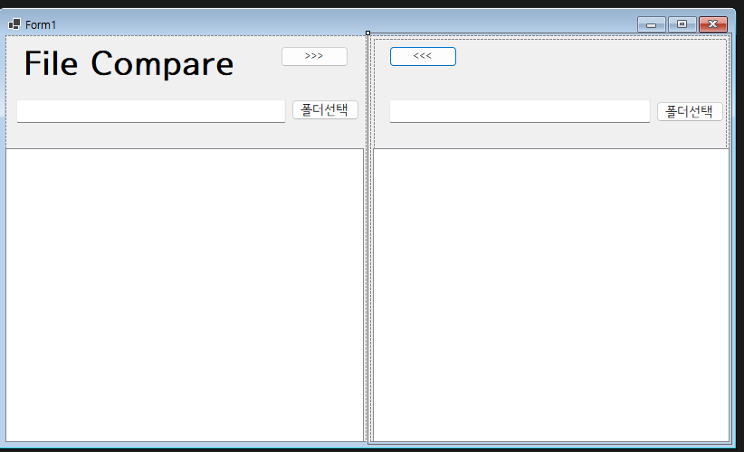
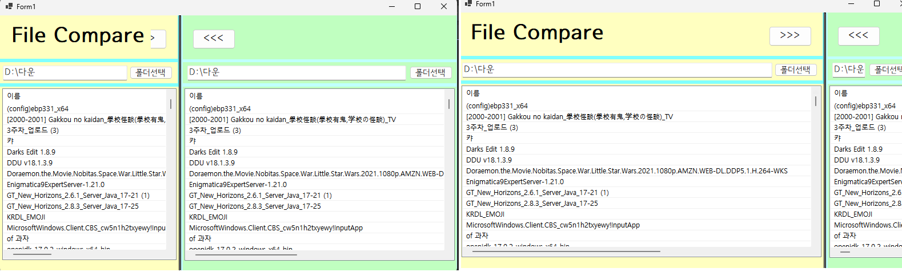
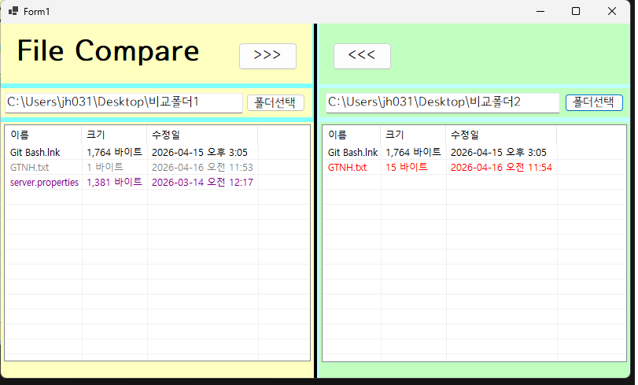
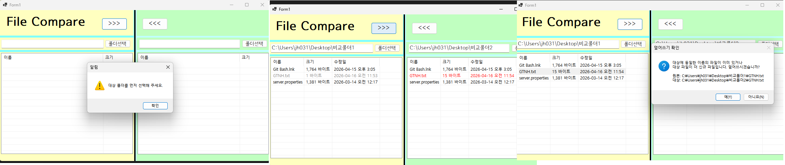
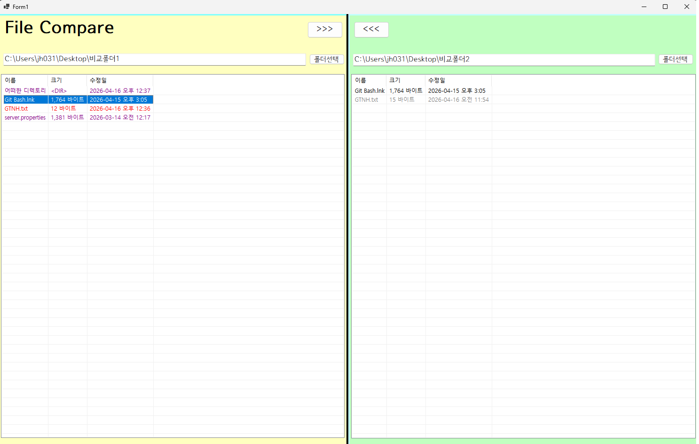

# (C# 코딩) 폴더 파일 비교

## 개요
- C# 프로그래밍 학습
- 1줄 소개: 폴더의 파일을 비교하고, 복사&붙여넣기 기능까지
- 사용한 플랫폼: 
  - C#, .NET Windows Forms, Visual Studio, GitHub
- 사용한 컨트롤:
  - Label, textbox, button, splitcontainer, panel, listview
- 사용한 기술과 구현한 기능:
  - Visual Studio를 이용하여 UI 디자인
  - splitview 기능을 통한 파일 분할
  - 폴더를 선택할 수 있는 버튼 추가
  - 오류 발생 시 messagebox로 출력
  - ForeColor로 글자색 바꾸기
  - FullRowSelect, GridLines로 파일 리스트 배치 형식 변경

## 실행 화면 (과제1)
- 과제1 코드의 실행 스크린샷

- 과제 내용
  - 기본 UI 배치
  - 화면 분할 및 분할화면 비중 줄여도 안잘리게 수정
- 구현 내용과 기능 설명
  - 라벨, 텍스트박스, 버튼, 스플릿컨테이너, 패널, 리스트박스 배치
  - anchor 기능을 panel 및 다른 버튼, 텍스트박스들에도 적용하여 splitContainer가 움직여도 자연스럽게 요소들이 움직이며 이상하게 잘리지 않도록 함

## 실행 화면 (과제2)
- 과제2 코드의 실행 스크린샷

- 과제 내용
  - 색감 디자인
  - 폴더 선택 기능 추가
  - 이름이 같은 파일 최신 파일 색 구분 추가
  - 같은 파일 색 구분 기능 추가
  - listview로 보기 좋게 디자인
- 구현 내용과 기능 설명
  - 폴더 리스트를 FullRowSelect, GridLines 설정하여 나열형이 아닌 위에서 아래로 리스트식으로 배치되게 함
  - Columns 설정으로 각 범주의 이름, 요소별 길이를 설정함
  - if문으로 왼쪽, 오른쪽 폴더를 비교군 삼아 충족하는 경우 ForeColor를 설정하여 색을 변경함
  -  

## 실행 화면 (과제3)
- 과제3 코드의 실행 스크린샷

- 과제 내용

- 구현 내용과 기능 설명

## 실행 화면 (과제4)
- 과제4 코드의 실행 스크린샷

- 과제 내용

- 구현 내용과 기능 설명
